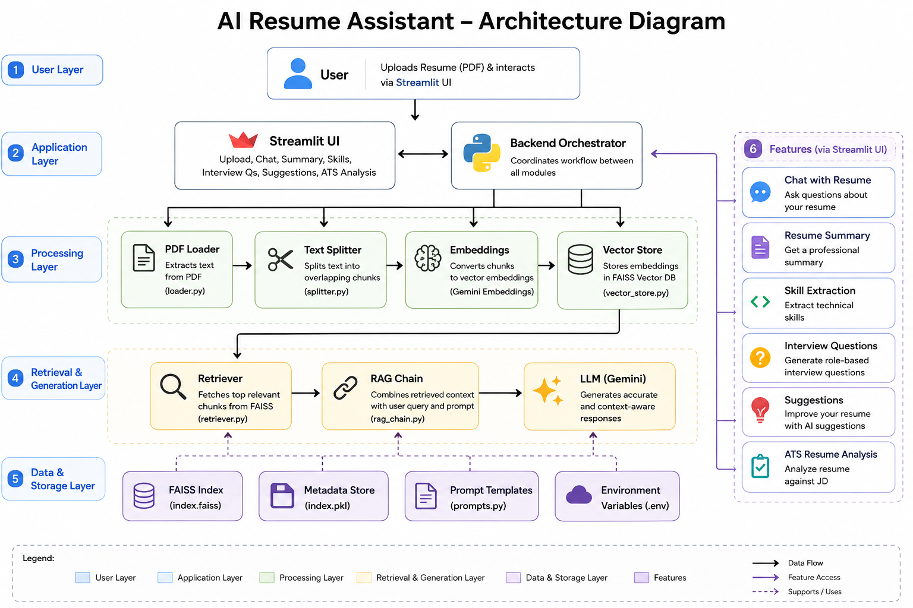
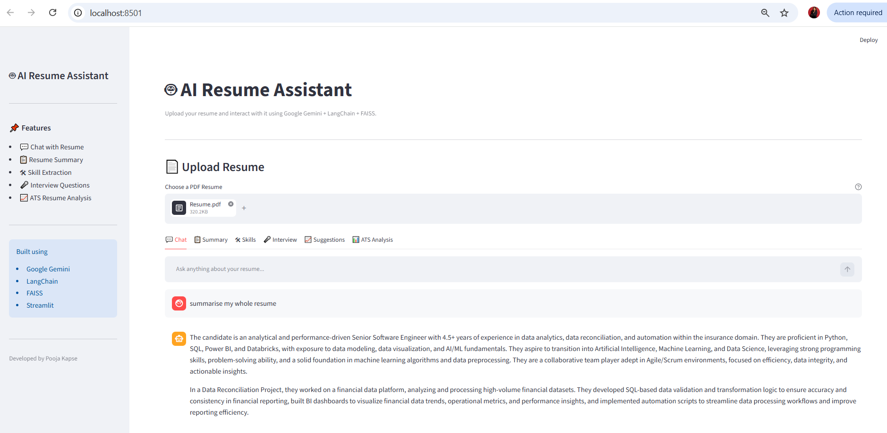
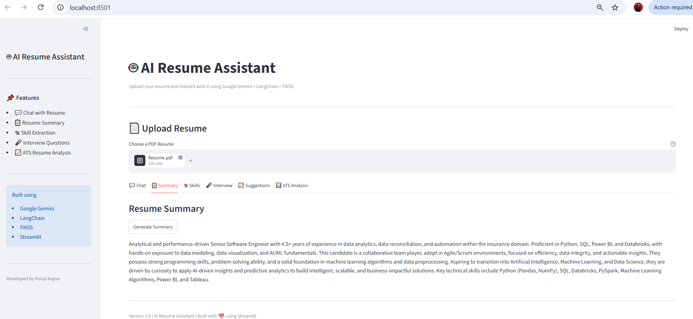
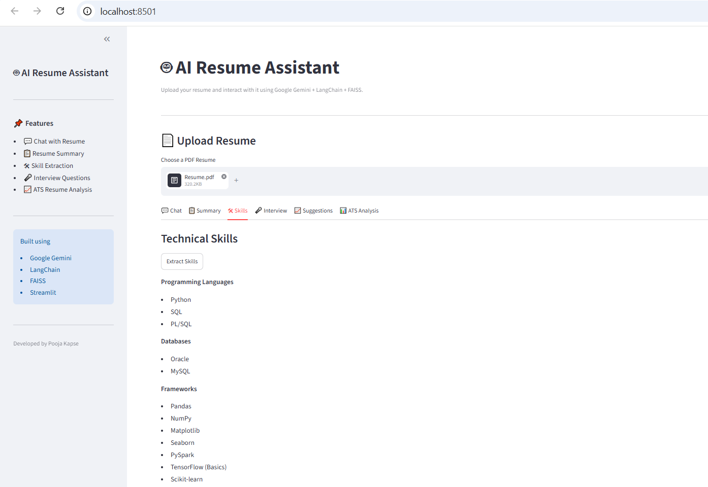
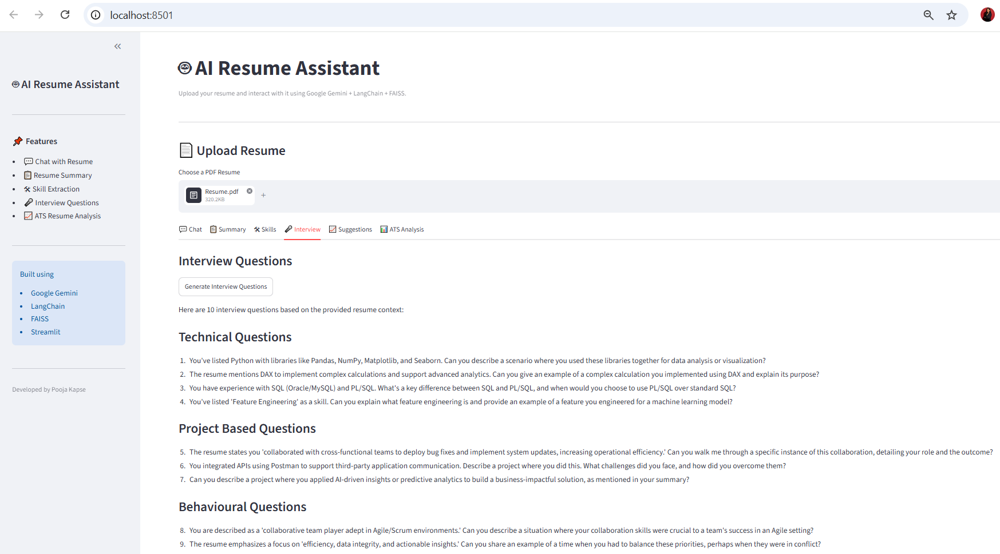
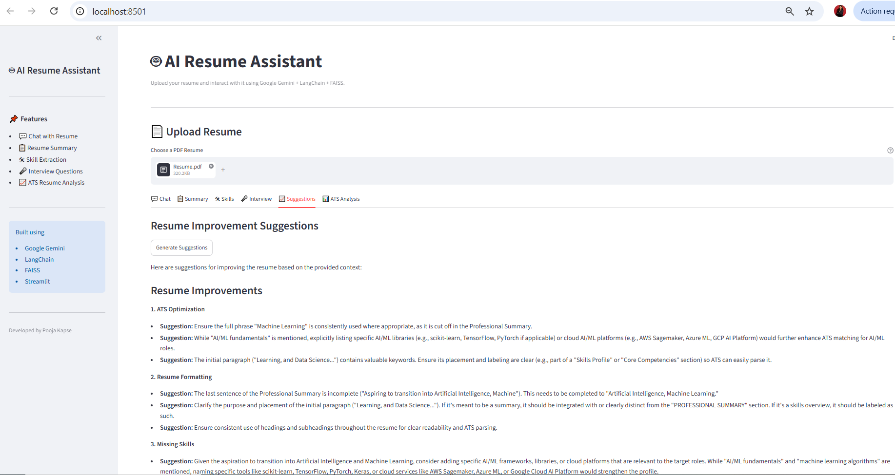
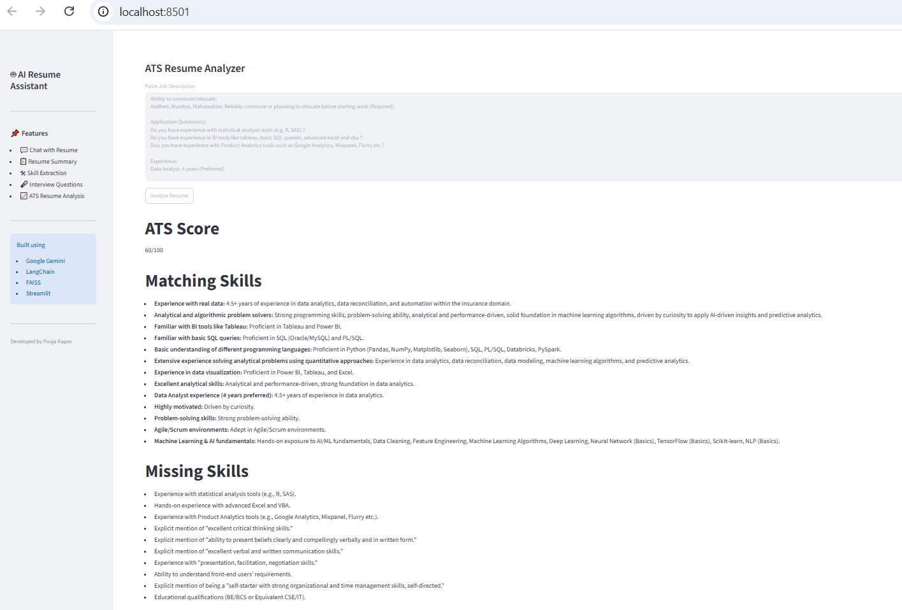

<div align="center">

# 🤖 AI Resume Assistant

### AI-Powered Resume Analyzer using **Google Gemini**, **LangChain**, **FAISS**, and **Streamlit**


A Retrieval-Augmented Generation (RAG) application that enables users to upload their resume, chat with it, generate professional insights, and perform ATS analysis using Google's Gemini LLM.

</div>

---

# 📑 Table of Contents

- [Project Overview](#-project-overview)
- [Features](#-features)
- [Architecture](#-architecture)
- [Tech Stack](#-tech-stack)
- [Project Structure](#-project-structure)
- [Installation](#-installation)
- [How to Run](#-how-to-run)
- [Application Workflow](#-application-workflow)
- [Screenshots](#-screenshots)
- [Learning Outcomes](#-learning-outcomes)
- [Future Enhancements](#-future-enhancements)
- [Author](#-author)
- [License](#-license)

---

# 📌 Project Overview

AI Resume Assistant is a **Retrieval-Augmented Generation (RAG)** application built using **Google Gemini**, **LangChain**, **FAISS**, and **Streamlit**.

The application allows users to upload a resume in PDF format and interact with it using natural language.

Instead of sending the entire resume to the LLM every time, the application:

- Extracts text from the PDF
- Splits it into meaningful chunks
- Converts chunks into vector embeddings
- Stores them inside FAISS
- Retrieves only the most relevant chunks
- Uses Gemini to generate context-aware responses

This makes the application faster, cheaper, and more accurate than prompting with the complete document.

---

# ✨ Features

- 💬 Chat with Resume
- 📄 Resume Summary Generator
- 🛠 Technical Skills Extraction
- 🎤 AI-generated Interview Questions
- 📈 Resume Improvement Suggestions
- 📊 ATS Resume Analysis
- 📚 Semantic Search using FAISS
- 🤖 Google Gemini Integration
- ⚡ LangChain RAG Pipeline
- 🌐 Streamlit Web Interface

---

# 🏗 Architecture

<p align="center">
    
</p>

---

# 🛠 Tech Stack

| Technology | Purpose |
|------------|---------|
| Python | Programming Language |
| Google Gemini | Large Language Model |
| LangChain | RAG Framework |
| FAISS | Vector Database |
| Google Generative AI Embeddings | Embedding Model |
| Streamlit | Frontend Web Application |
| PyPDF | PDF Processing |
| Git & GitHub | Version Control |

---

# 📂 Project Structure

```text
AI-Resume-Assistant-V2/
│
├── assets/
│   ├── architecture.png
│   └── screenshots/
│
├── src/
│   ├── ats.py
│   ├── backend.py
│   ├── file_manager.py
│   ├── loader.py
│   ├── prompts.py
│   ├── rag_chain.py
│   ├── resume_features.py
│   ├── retriever.py
│   ├── services.py
│   ├── splitter.py
│   └── vector_store.py
│
├── streamlit_app.py
├── config.py
├── requirements.txt
└── README.md
```

---

# ⚙ Installation

Clone the repository

```bash
git clone https://github.com/poojakapse0711/AI-Resume-Assistant-V2.git
```

Navigate to the project

```bash
cd AI-Resume-Assistant-V2
```

Create virtual environment

```bash
python -m venv venv
```

Activate virtual environment

Windows

```bash
venv\Scripts\activate
```

Linux / Mac

```bash
source venv/bin/activate
```

Install dependencies

```bash
pip install -r requirements.txt
```

---

# 🔑 Environment Variables

Create a `.env` file.

```env
GOOGLE_API_KEY=YOUR_API_KEY
```

---

# ▶ How to Run

```bash
streamlit run streamlit_app.py
```

The application will open in your browser.
---

# 🔄 Application Workflow

The following diagram represents the end-to-end workflow of the application.

```text
                 User
                   │
                   ▼
         Upload Resume (PDF)
                   │
                   ▼
          Streamlit Web Interface
                   │
                   ▼
             Backend Service
                   │
        ┌──────────┴──────────┐
        ▼                     ▼
   PDF Loader           Text Splitter
        │                     │
        └──────────┬──────────┘
                   ▼
       Gemini Embedding Model
                   │
                   ▼
        FAISS Vector Database
                   │
                   ▼
          Semantic Retriever
                   │
                   ▼
             RAG Pipeline
                   │
                   ▼
           Google Gemini LLM
                   │
                   ▼
        AI Generated Response
```

---

# 📸 Screenshots

## 🏠 Home Page

<p align="center">

</p>

---

## 📄 Upload Resume

<p align="center">

</p>

---

## 💬 Chat with Resume

<p align="center">

</p>

---

## 📄 Resume Summary

<p align="center">

</p>

---

## 🛠 Skills Extraction

<p align="center">

</p>

---

## 🎤 Interview Questions

<p align="center">

</p>

---

## 📈 Resume Suggestions

<p align="center">

</p>

---

## 📊 ATS Resume Analyzer

<p align="center">

</p>

---

## 🤖 AI Response

<p align="center">

</p>

---

# 🧠 RAG Pipeline Explained

This project follows the **Retrieval-Augmented Generation (RAG)** architecture.

### Step 1

User uploads a resume in PDF format.

↓

### Step 2

The PDF is loaded using **PyPDFLoader**.

↓

### Step 3

The document is split into overlapping chunks using LangChain's `RecursiveCharacterTextSplitter`.

↓

### Step 4

Each chunk is converted into vector embeddings using Google's **Gemini Embedding Model**.

↓

### Step 5

The embeddings are stored inside a **FAISS Vector Database**.

↓

### Step 6

Whenever a user asks a question, the question is converted into an embedding.

↓

### Step 7

FAISS retrieves the most relevant chunks based on semantic similarity.

↓

### Step 8

The retrieved chunks along with the user's question are sent to Google Gemini.

↓

### Step 9

Gemini generates an accurate context-aware response.

---

# 🎯 Learning Outcomes

Through this project, I gained hands-on experience with:

- Retrieval-Augmented Generation (RAG)
- Large Language Models (Google Gemini)
- Prompt Engineering
- Semantic Search
- Embedding Models
- Vector Databases (FAISS)
- LangChain Framework
- Streamlit Application Development
- Modular Python Project Architecture
- Session State Management
- AI-powered Resume Analysis
- ATS Resume Evaluation

---

# 🚀 Future Enhancements

Potential improvements for future versions include:

- AI Cover Letter Generator
- Resume ↔ Job Description Match Score
- Multi-Resume Comparison
- Resume Download as PDF
- Chat History Persistence
- User Authentication
- Cloud Database Integration
- Deployment on Streamlit Cloud
- Multi-language Resume Support
- Voice-based Resume Assistant

---

# 👨‍💻 About the Project

This project was built to understand the complete lifecycle of a **Retrieval-Augmented Generation (RAG)** application using modern Generative AI technologies.

Rather than relying solely on prompt engineering, the application demonstrates how semantic search, vector databases, and LLMs can be combined to build accurate, context-aware AI applications.

The project emphasizes clean architecture, modular code organization, and practical implementation of GenAI concepts.

---

# 👩‍💻 Author

**Pooja Kapse**

Senior Software Engineer | GenAI Enthusiast

### Connect with me

- GitHub: https://github.com/poojakapse0711
- LinkedIn: https://linkedin.com/in/pooja-kapse7

**Skills**

- Python
- SQL
- Databricks
- Power BI
- Google Gemini
- LangChain
- FAISS
- Streamlit

If you found this project useful, consider giving it a ⭐ on GitHub.

---

# 📄 License

This project is licensed under the MIT License.

---

<div align="center">

## ⭐ Thank you for visiting this repository!

If you found this project helpful, please consider giving it a ⭐ on GitHub.

Happy Learning! 🚀

</div>