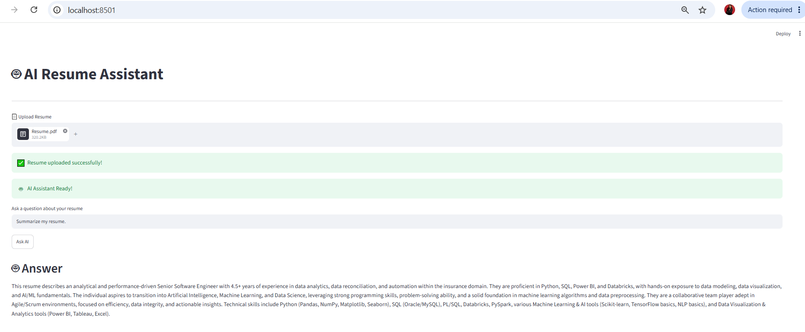

# 🤖 AI Resume Assistant

An AI-powered Resume Assistant built using **Google Gemini**, **LangChain**, **FAISS**, and **Streamlit**.

Upload any resume in PDF format and ask questions about it using Natural Language.

---

# 🚀 Features

- 📄 Upload any Resume (PDF)
- 🤖 Chat with your Resume
- 🔍 Semantic Search using FAISS
- 🧠 Google Gemini LLM
- 📚 LangChain RAG Pipeline
- ⚡ Fast document retrieval
- 💻 Streamlit Web Interface

---

# 🛠️ Tech Stack

- Python
- Google Gemini
- LangChain
- FAISS
- Streamlit
- PyPDF
- Python Dotenv

---

# 📸 Screenshots

## Home Screen


---

## Upload Resume


---

## Ask Questions



---

# 📂 Project Structure

```text
AI-Resume-Assistant-V2/
│
├── app.py
├── streamlit_app.py
├── config.py
├── requirements.txt
├── README.md
├── .env
│
├── data/
│
├── faiss_index/
│
├── assets/
│   └── screenshots/
│       ├── home.png
│       ├── upload.png
│       └── answer.png
│
└── src/
    ├── backend.py
    ├── loader.py
    ├── splitter.py
    ├── vector_store.py
    ├── retriever.py
    ├── rag_chain.py
    └── prompts.py
```

---

# ⚙️ Installation

## Clone Repository

```bash
git clone https://github.com/YOUR_GITHUB_USERNAME/AI-Resume-Assistant-V2.git
```

---

## Navigate to Project

```bash
cd AI-Resume-Assistant-V2
```

---

## Create Virtual Environment

Windows

```bash
python -m venv venv
```

Activate

```bash
venv\Scripts\activate
```

---

## Install Dependencies

```bash
pip install -r requirements.txt
```

---

## Create .env File

```text
GOOGLE_API_KEY=YOUR_GEMINI_API_KEY
```

---

## Run the Application

```bash
streamlit run streamlit_app.py
```

---

# 💡 How It Works

```
User Uploads Resume
          │
          ▼
     PDF Loader
          │
          ▼
 Text Splitter
          │
          ▼
 Gemini Embeddings
          │
          ▼
  FAISS Vector Store
          │
          ▼
    Semantic Search
          │
          ▼
     Google Gemini
          │
          ▼
        Answer
```

---

# 🎯 Current Features

- ✅ Resume Upload
- ✅ PDF Parsing
- ✅ Document Chunking
- ✅ Google Gemini Embeddings
- ✅ FAISS Vector Database
- ✅ Semantic Search
- ✅ RAG Pipeline
- ✅ Streamlit Interface

---

# 🚀 Upcoming Features

- 💬 Chat History
- 📄 Resume Summary
- 🎤 Interview Questions Generator
- 📊 ATS Resume Analysis
- ✨ Resume Improvement Suggestions
- 📥 Download AI Summary
- ☁️ Deployment

---

# 👩‍💻 Author

**Pooja Kapse**

GitHub: https://github.com/poojakapse0711

---

# ⭐ If you like this project

Please consider giving it a ⭐ on GitHub.